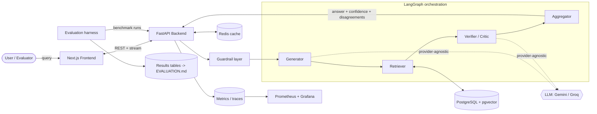
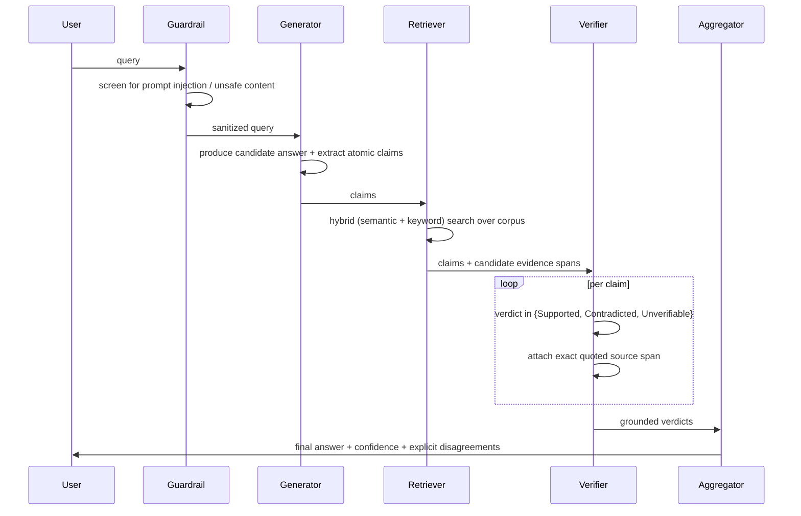

# Architecture

This document describes Aletheia's system design, the data flow through the agent
pipeline, and the reasoning behind major engineering decisions. It evolves with
the code; diagrams and components are added as each phase lands. The locked,
cross-cutting design decisions it builds on — domain focus, the
verification-not-advice safety boundary, the corpus-first knowledge source, and the
benchmarking split — are recorded as Architecture Decision Records in
[`docs/design/`](docs/design/).

## 1. Design goals

1. **Evidence over opinion.** Every verification verdict must be traceable to a
   quoted source span. The architecture makes ungrounded verdicts structurally
   hard to emit.
2. **Measurability first.** The system is built to be evaluated. Traces, metrics,
   and deterministic-as-possible runs are core, not bolt-ons.
3. **Provider-agnostic.** No hard dependency on any single LLM vendor. Models are
   swappable behind a thin client interface and selected via environment config.
4. **Free-tier, reproducible.** The entire stack runs locally via
   `docker compose up`, and each component has a free hosting path.
5. **Observable.** A user (or evaluator) can follow the agent/verification path
   live.

## 2. High-level component map



## 3. The verification pipeline (data flow)



The key invariant: a `Supported` or `Contradicted` verdict is only valid when it
carries a quoted span from a retrieved source. This is what defeats *false
agreement* — agents cannot simply echo each other; they must point at text.

## 4. Component responsibilities

| Component | Responsibility |
| --- | --- |
| **Frontend** (Next.js) | Submit queries; stream and render the live agent path, confidence, and disagreements. |
| **Backend** (FastAPI) | Orchestrate the graph, expose REST + streaming endpoints, emit metrics/traces. |
| **Guardrail** | Screen inputs for prompt injection; filter unsafe content before any agent runs. |
| **Generator** | Produce a candidate answer and decompose it into atomic, checkable claims. |
| **Retriever** | Hybrid search over the pgvector-backed corpus; return candidate evidence. |
| **Verifier / Critic** | Judge each claim against evidence; emit a verdict with a quoted span. |
| **Aggregator** | Combine verdicts into a final answer, calibrated confidence, and disagreement list. |
| **Evaluation harness** | Run benchmarks repeatedly, log traces, compute metrics vs a single-LLM baseline. |
| **Observability** | Prometheus metrics + Grafana dashboards + OTel-style traces of agent runs. |

## 5. Repository layout

```
.
├── backend/        # FastAPI service, LangGraph agents, retrieval (uv-managed)
├── frontend/       # Next.js App Router dashboard (TypeScript)
├── eval/           # Evaluation harness — the project centerpiece (Phase 3)
├── infra/          # Kubernetes manifests, observability config, deploy notes
├── docker-compose.yml   # Local full-stack: backend, frontend, postgres+pgvector, redis
└── .github/workflows/   # CI: lint, type-check, test (backend + frontend)
```

`docker-compose.yml` lives at the repository root (idiomatic, discoverable);
each service owns its `Dockerfile`. Kubernetes manifests and observability
configuration live under `infra/` and arrive in Phase 5.

## 6. Major decisions & rationale

| Decision | Rationale | Free? |
| --- | --- | --- |
| **Monorepo** | Atomic cross-stack changes; one URL for reviewers to navigate. | ✅ |
| **uv** for Python | Fast, lockfile-based, reproducible installs; modern standard. | ✅ |
| **`src/` layout** for the backend package | Prevents accidental imports of uninstalled code; senior-grade hygiene. | ✅ |
| **LangGraph** for orchestration | Explicit, inspectable agent state machines — ideal for tracing/evaluation. | ✅ |
| **PostgreSQL + pgvector** | One store for relational data *and* vectors; enables hybrid search. | ✅ |
| **Provider-agnostic LLM client** | Avoids vendor lock-in; lets the harness swap models for fair comparison. | ✅ |
| **Pydantic settings** | Typed, validated configuration from environment variables. | ✅ |

Significant future changes to these choices will be recorded here with their
justification, per the working rules.

## 7. Status

- **Phase 0** established the skeleton: a FastAPI service exposing `/health`, a
  Next.js landing page, the container/compose baseline, and CI.
- **Phase 1** implemented the first intelligent components: a provider-agnostic
  LLM client (Gemini / Groq behind one interface), the verification verdict
  contract that makes ungrounded verdicts structurally impossible, a LangGraph
  **Generator → Verifier → Aggregator** pipeline, a `POST /verify` endpoint, and
  a first measurable comparison against a single-LLM baseline. Evidence is
  supplied by the caller in this phase; the **Retriever** (Section 3) replaces it
  with hybrid search in Phase 2, leaving the downstream contract unchanged.

The remaining components (retrieval, guardrails, the full evaluation harness,
observability) land in later phases, in roadmap order.
