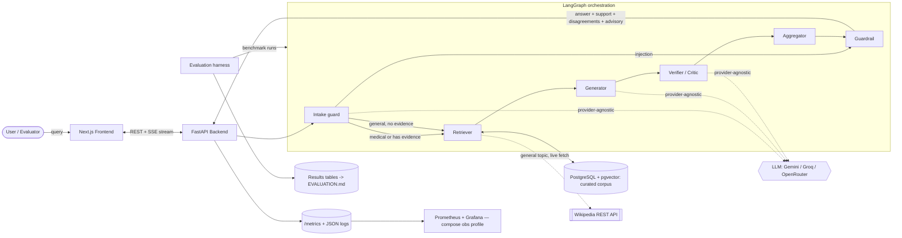
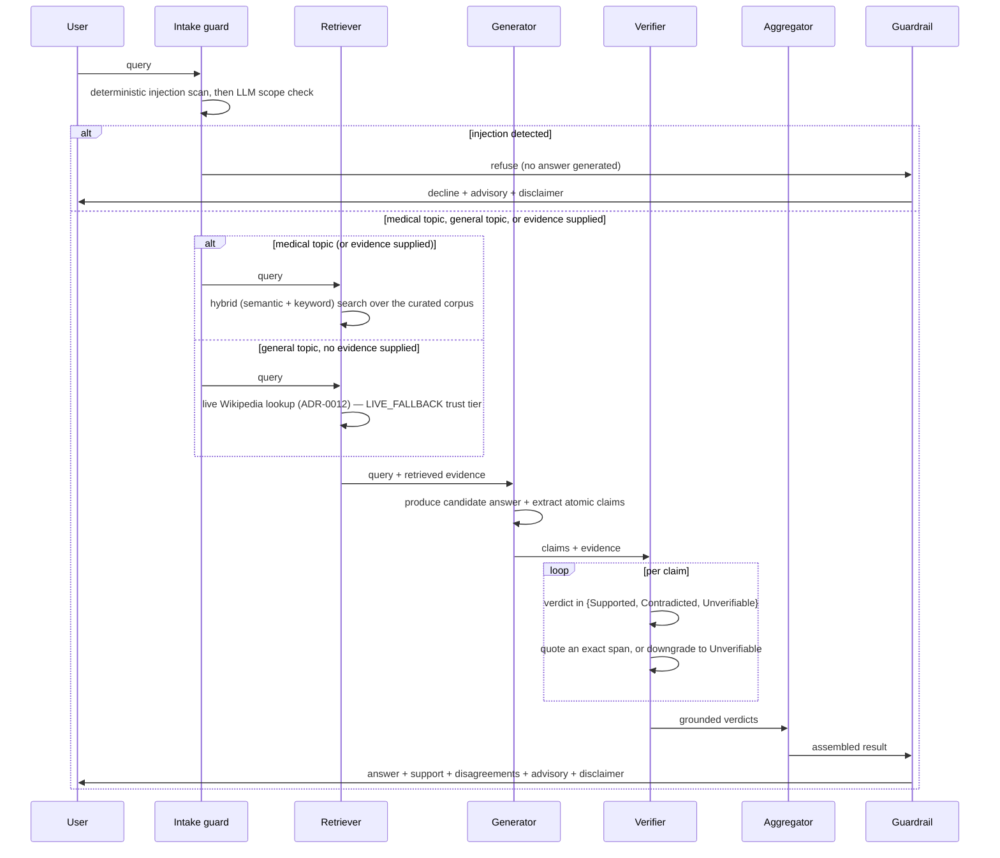

# Architecture

This document describes Aletheia's system design, the data flow through the agent
pipeline, and the reasoning behind major engineering decisions. It evolves with
the code; diagrams and components are added as each phase lands. The locked,
cross-cutting design decisions it builds on — domain focus, the
verification-not-advice safety boundary, the corpus-first knowledge source, and the
benchmarking split — are recorded as Architecture Decision Records in
[`docs/design/`](docs/design/).

## 1. Design goals

1. **Evidence over opinion.** Every verification verdict must be traceable to a
   quoted source span. The architecture makes ungrounded verdicts structurally
   hard to emit.
2. **Measurability first.** The system is built to be evaluated. Traces, metrics,
   and deterministic-as-possible runs are core, not bolt-ons.
3. **Provider-agnostic.** No hard dependency on any single LLM vendor. Models are
   swappable behind a thin client interface and selected via environment config.
4. **Free-tier, reproducible.** The entire stack runs locally via
   `docker compose up`, and each component has a free hosting path.
5. **Observable.** A user (or evaluator) can follow the agent/verification path
   live.

## 2. High-level component map



The order is fixed and linear: an **Intake guard** classifies the query, then
(**Retriever →**) **Generator → Verifier → Aggregator → Guardrail**. The
Guardrail runs **last** and is advisory — it attaches a safety assessment and
the standing disclaimer but never edits a verdict. Only a prompt-injection
match actually terminates in a refusal, which skips straight to the Guardrail
with a decline so it still returns the same result shape
([ADR-0012](docs/design/0012-live-wikipedia-fallback-for-general-claims.md));
every other query — medical or general — proceeds through the full pipeline.

**Three evidence sources feed the same pipeline unchanged.** A caller can (1)
supply no evidence for a medical topic — the Retriever searches the frozen,
curated corpus; (2) supply `evidence` directly — a pasted or uploaded document,
in **any domain**, not just medical
([ADR-0010](docs/design/0010-own-document-verification-any-domain.md)); or (3)
supply no evidence for a general, non-medical topic — the Retriever falls back
to a live Wikipedia lookup instead of refusing
([ADR-0012](docs/design/0012-live-wikipedia-fallback-for-general-claims.md)).
The Generator, Verifier, Aggregator, and verdict contract are identical across
all three; only the *evidence source* and its **trust tier** differ. The
Intake guard's medical-scope classifier only decides *which* of (1) or (3)
applies — a caller-supplied-evidence request skips it entirely and goes
straight to the injection scan, which always runs regardless of evidence
source. Own-document citations carry no trust tier (there is nothing to rank)
and are labelled "your document"; live Wikipedia citations carry the
`LIVE_FALLBACK` tier, clearly marked as lower-trust and never mixed in as
though they were corpus-grade (ADR-0003).

## 3. The verification pipeline (data flow)



The key invariant: a `Supported` or `Contradicted` verdict is only valid when it
carries a quoted span that is present verbatim in the evidence — otherwise it is
downgraded to `Unverifiable`. This is what defeats *false agreement*: agents
cannot simply echo each other; they must point at text. The Intake guard is a
*scope and injection* gate (it decides whether to answer at all); the Guardrail
is a *non-mutating output advisory* — two different jobs at the two ends of the
pipeline.

## 4. Component responsibilities

| Component | Responsibility |
| --- | --- |
| **Frontend** (Next.js) | Submit queries; stream and render the live agent path, evidence-support meter, and disagreements. |
| **Backend** (FastAPI) | Orchestrate the graph, expose REST + SSE streaming endpoints, emit traces. |
| **Claim intake** (`POST /extract`) | Turn one uploaded PDF / image / voice note into text for the *editable* query field (pypdf / Gemini vision / Groq Whisper). In-memory only, rate-limited with `/verify`, never verifies anything (ADR-0009). |
| **Intake guard** | *First* node: a deterministic prompt-injection scan, then an LLM scope check. Only an injection match refuses; a general (non-medical) query is admitted and routed to the live Wikipedia fallback instead of the corpus (ADR-0012). Fails open to the grounded verifier if the classifier is unavailable. |
| **Retriever** | Hybrid (semantic + keyword, RRF-fused) search over the pgvector-backed corpus for medical topics, or a live Wikipedia lookup for general ones (ADR-0012, `LIVE_FALLBACK` trust tier); returns trust-tiered evidence either way. Runs only when the caller supplies no evidence — an evidence-bearing request (own-document mode, ADR-0010) skips it entirely. Can optionally scope corpus search to one ingested connector (used by the benchmark harness so two co-resident corpora, e.g. SciFact and FEVER, never leak into each other's runs). |
| **Generator** | Produce a candidate answer (or decompose a supplied one) into atomic, checkable claims. |
| **Verifier / Critic** | Judge each claim against evidence; emit a verdict with a quoted span, or downgrade to Unverifiable. |
| **Aggregator** | Combine verdicts into the returnable result (answer, per-claim verdicts, evidence-support ratio, disagreements). |
| **Guardrail** | *Last* node: a non-mutating advisory (info / caution / high-caution) plus the standing medical-advice disclaimer. Never edits a verdict. |
| **Evaluation harness** | Run benchmarks repeatedly (seeded), log traces, compute metrics vs a single-LLM baseline and an ungrounded ablation arm. |
| **Observability** | Prometheus `/metrics` with per-stage duration histograms, request-id-tagged JSON logs, and a local Grafana stack behind the compose `obs` profile (Phase 5, D2). |

## 5. Repository layout

```
.
├── backend/        # FastAPI service, LangGraph agents, retrieval, and the
│   │               # evaluation harness (uv-managed)
│   ├── src/aletheia/corpus/connectors/   # pluggable per-source connectors
│   │                                     # (pubmed, pmc, scifact, fever — ADR-0001/0011)
│   ├── src/aletheia/corpus/live_wikipedia.py   # live-only fallback, never ingested (ADR-0012)
│   └── src/aletheia/evaluation/   # the harness — the project centerpiece (Phase 3)
├── frontend/       # Next.js App Router app (TypeScript): landing, /verify, /benchmark
├── eval/           # Pointer/notes only; the harness code lives in the backend package
├── infra/          # Kubernetes manifests, observability config, deploy notes (Phase 5)
├── docs/design/    # Architecture Decision Records (locked decisions)
├── docs/plans/     # Working improvement plans
├── docker-compose.yml   # Local full-stack: backend, frontend, postgres+pgvector (+ obs profile)
└── .github/workflows/   # CI: lint, format, type-check, test (backend + frontend)
```

`docker-compose.yml` lives at the repository root (idiomatic, discoverable);
each service owns its `Dockerfile`. The **evaluation harness lives inside the
backend package** (`backend/src/aletheia/evaluation/`), not in a separate
top-level project, because it imports the pipeline directly and is exercised by
the same CI and lockfile; `eval/` holds only a pointer and run notes. Kubernetes
manifests and observability configuration live under `infra/` and arrive in
Phase 5.

## 6. Major decisions & rationale

| Decision | Rationale | Free? |
| --- | --- | --- |
| **Monorepo** | Atomic cross-stack changes; one URL for reviewers to navigate. | ✅ |
| **uv** for Python | Fast, lockfile-based, reproducible installs; modern standard. | ✅ |
| **`src/` layout** for the backend package | Prevents accidental imports of uninstalled code; senior-grade hygiene. | ✅ |
| **LangGraph** for orchestration | Explicit, inspectable agent state machines — ideal for tracing/evaluation. | ✅ |
| **PostgreSQL + pgvector** | One store for relational data *and* vectors; enables hybrid search. | ✅ |
| **Provider-agnostic LLM client** | Avoids vendor lock-in; lets the harness swap models for fair comparison. | ✅ |
| **Pydantic settings** | Typed, validated configuration from environment variables. | ✅ |
| **No cache layer** | Redis removed as unused: retrieval is sub-second and local while LLM calls dominate; nothing worth caching at demo scale ([ADR-0008](docs/design/0008-remove-redis.md)). | ✅ |

Significant future changes to these choices will be recorded here with their
justification, per the working rules.

## 7. Status

- **Phase 0** established the skeleton: a FastAPI service exposing `/health`, a
  Next.js landing page, the container/compose baseline, and CI.
- **Phase 1** implemented the first intelligent components: a provider-agnostic
  LLM client, the verification verdict contract that makes ungrounded verdicts
  structurally impossible, a LangGraph Generator → Verifier → Aggregator
  pipeline, a `POST /verify` endpoint, and a first single-LLM comparison.
- **Phase 2** added retrieval and grounding: PostgreSQL + pgvector, hybrid
  (semantic + keyword, RRF-fused) search wired into the graph as the
  **Retriever**, trust-tiered citations, and the **Guardrail** output advisory.
- **Phase 3** built the evaluation harness: the SciFact benchmark and its
  ingested corpus, a three-way metric suite, full trace logging, a seeded
  grounded-vs-baseline runner with an **ungrounded ablation arm** and **paired
  significance** (McNemar + bootstrap), and auto-generated `EVALUATION.md` tables.
- **Phase 4** delivered the real-time frontend: SSE streaming of the verification
  path (`POST /verify/stream`), the live `/verify` view, and a `/benchmark` page.
- **Phase 5** landed a resilient LLM client (cross-provider fail-over), the
  **Intake guard** (scope + injection), the free-tier deployment decision with
  its per-IP rate limiter ([ADR-0007](docs/design/0007-free-tier-live-demo-deployment.md)),
  right-sized observability (`/metrics`, per-stage histograms, request-id JSON
  logs, a local Grafana compose profile), the decision to remove Redis
  ([ADR-0008](docs/design/0008-remove-redis.md)), and reference k8s manifests.
  Live-demo provisioning (the dashboards themselves) remains a manual step.
- **Post-Phase-5 additions**, unplanned but shipped: **multimodal claim intake**
  (`POST /extract` — PDF/photo/voice fill the editable query field before
  verifying, ADR-0009); **own-document verification** — bring a claim from any
  field and check it against your own document instead of the medical corpus,
  in any domain, with truthful "your document" provenance labeling (ADR-0010);
  a **live Wikipedia fallback** completing ADR-0003's deferred lower-trust tier
  — a general, non-medical query with no document supplied is no longer
  refused, it is checked live against Wikipedia's own REST API and clearly
  marked `LIVE_FALLBACK` rather than mixed in with the curated corpus
  ([ADR-0012](docs/design/0012-live-wikipedia-fallback-for-general-claims.md));
  and optional accounts with bring-your-own encrypted provider keys and a
  per-user history view.
- **Phase 6 (in progress)** is generalizing the *measured* story to a second
  domain: **FEVER** (Wikipedia claims, any topic) on a seeded, closed corpus
  slice sized like SciFact's, so the "benchmark on a fixed corpus" rule
  (ADR-0006) still holds without ingesting FEVER's full 5.4M-page dump
  ([ADR-0011](docs/design/0011-fever-second-benchmark-domain.md)). The
  connector, benchmark loader, and slice builder are built and offline-tested;
  the live n=100 run is the one step still pending its own quota day. Phase 6
  also re-ran the SciFact headline with an improved verifier prompt — catch
  rate 82.8% vs 60.3% baseline, and for the first time aggregate accuracy
  improves too (see [`EVALUATION.md`](EVALUATION.md) §6.2).

Provider-agnostic note: the LLM client supports Gemini, Groq, and OpenRouter
behind one interface, with an optional fail-over chain (Section 6 lists the
core decisions).
