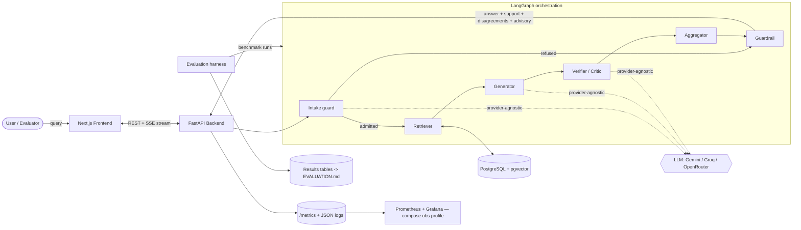
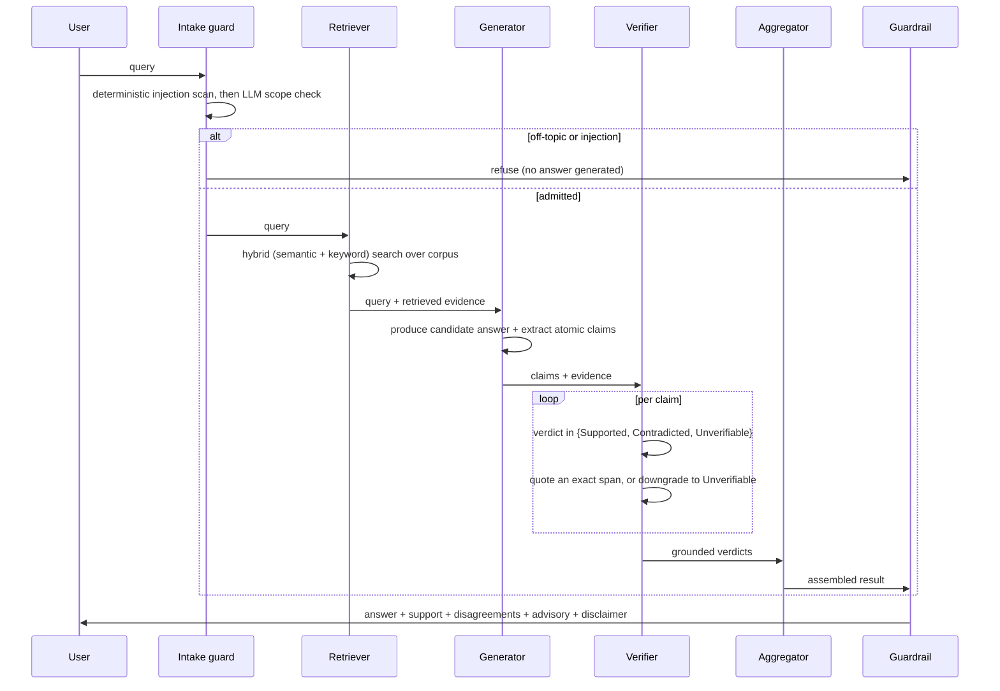

# Architecture

This document describes Aletheia's system design, the data flow through the agent
pipeline, and the reasoning behind major engineering decisions. It evolves with
the code; diagrams and components are added as each phase lands. The locked,
cross-cutting design decisions it builds on — domain focus, the
verification-not-advice safety boundary, the corpus-first knowledge source, and the
benchmarking split — are recorded as Architecture Decision Records in
[`docs/design/`](docs/design/).

## 1. Design goals

1. **Evidence over opinion.** Every verification verdict must be traceable to a
   quoted source span. The architecture makes ungrounded verdicts structurally
   hard to emit.
2. **Measurability first.** The system is built to be evaluated. Traces, metrics,
   and deterministic-as-possible runs are core, not bolt-ons.
3. **Provider-agnostic.** No hard dependency on any single LLM vendor. Models are
   swappable behind a thin client interface and selected via environment config.
4. **Free-tier, reproducible.** The entire stack runs locally via
   `docker compose up`, and each component has a free hosting path.
5. **Observable.** A user (or evaluator) can follow the agent/verification path
   live.

## 2. High-level component map



The order is fixed and linear: an **Intake guard** admits or refuses the query,
then (**Retriever →**) **Generator → Verifier → Aggregator → Guardrail**. The
Retriever runs only when the caller supplies no evidence; the Guardrail runs
**last** and is advisory — it attaches a safety assessment and the standing
disclaimer but never edits a verdict. A refused query skips straight to the
Guardrail with a decline, so it still returns the same result shape.

## 3. The verification pipeline (data flow)



The key invariant: a `Supported` or `Contradicted` verdict is only valid when it
carries a quoted span that is present verbatim in the evidence — otherwise it is
downgraded to `Unverifiable`. This is what defeats *false agreement*: agents
cannot simply echo each other; they must point at text. The Intake guard is a
*scope and injection* gate (it decides whether to answer at all); the Guardrail
is a *non-mutating output advisory* — two different jobs at the two ends of the
pipeline.

## 4. Component responsibilities

| Component | Responsibility |
| --- | --- |
| **Frontend** (Next.js) | Submit queries; stream and render the live agent path, evidence-support meter, and disagreements. |
| **Backend** (FastAPI) | Orchestrate the graph, expose REST + SSE streaming endpoints, emit traces. |
| **Intake guard** | *First* node: a deterministic prompt-injection scan, then an LLM scope check; refuse off-topic or adversarial input before any answer is generated (fails open to the grounded verifier if the classifier is unavailable). |
| **Retriever** | Hybrid (semantic + keyword, RRF-fused) search over the pgvector-backed corpus; returns trust-tiered evidence. Runs only when the caller supplies no evidence. |
| **Generator** | Produce a candidate answer (or decompose a supplied one) into atomic, checkable claims. |
| **Verifier / Critic** | Judge each claim against evidence; emit a verdict with a quoted span, or downgrade to Unverifiable. |
| **Aggregator** | Combine verdicts into the returnable result (answer, per-claim verdicts, evidence-support ratio, disagreements). |
| **Guardrail** | *Last* node: a non-mutating advisory (info / caution / high-caution) plus the standing medical-advice disclaimer. Never edits a verdict. |
| **Evaluation harness** | Run benchmarks repeatedly (seeded), log traces, compute metrics vs a single-LLM baseline and an ungrounded ablation arm. |
| **Observability** (planned) | Prometheus metrics + Grafana dashboards + OTel-style traces of agent runs (Phase 5). |

## 5. Repository layout

```
.
├── backend/        # FastAPI service, LangGraph agents, retrieval, and the
│   │               # evaluation harness (uv-managed)
│   └── src/aletheia/evaluation/   # the harness — the project centerpiece (Phase 3)
├── frontend/       # Next.js App Router app (TypeScript): landing, /verify, /benchmark
├── eval/           # Pointer/notes only; the harness code lives in the backend package
├── infra/          # Kubernetes manifests, observability config, deploy notes (Phase 5)
├── docs/design/    # Architecture Decision Records (locked decisions)
├── docs/plans/     # Working improvement plans
├── docker-compose.yml   # Local full-stack: backend, frontend, postgres+pgvector (+ obs profile)
└── .github/workflows/   # CI: lint, format, type-check, test (backend + frontend)
```

`docker-compose.yml` lives at the repository root (idiomatic, discoverable);
each service owns its `Dockerfile`. The **evaluation harness lives inside the
backend package** (`backend/src/aletheia/evaluation/`), not in a separate
top-level project, because it imports the pipeline directly and is exercised by
the same CI and lockfile; `eval/` holds only a pointer and run notes. Kubernetes
manifests and observability configuration live under `infra/` and arrive in
Phase 5.

## 6. Major decisions & rationale

| Decision | Rationale | Free? |
| --- | --- | --- |
| **Monorepo** | Atomic cross-stack changes; one URL for reviewers to navigate. | ✅ |
| **uv** for Python | Fast, lockfile-based, reproducible installs; modern standard. | ✅ |
| **`src/` layout** for the backend package | Prevents accidental imports of uninstalled code; senior-grade hygiene. | ✅ |
| **LangGraph** for orchestration | Explicit, inspectable agent state machines — ideal for tracing/evaluation. | ✅ |
| **PostgreSQL + pgvector** | One store for relational data *and* vectors; enables hybrid search. | ✅ |
| **Provider-agnostic LLM client** | Avoids vendor lock-in; lets the harness swap models for fair comparison. | ✅ |
| **Pydantic settings** | Typed, validated configuration from environment variables. | ✅ |
| **No cache layer** | Redis removed as unused: retrieval is sub-second and local while LLM calls dominate; nothing worth caching at demo scale ([ADR-0008](docs/design/0008-remove-redis.md)). | ✅ |

Significant future changes to these choices will be recorded here with their
justification, per the working rules.

## 7. Status

- **Phase 0** established the skeleton: a FastAPI service exposing `/health`, a
  Next.js landing page, the container/compose baseline, and CI.
- **Phase 1** implemented the first intelligent components: a provider-agnostic
  LLM client, the verification verdict contract that makes ungrounded verdicts
  structurally impossible, a LangGraph Generator → Verifier → Aggregator
  pipeline, a `POST /verify` endpoint, and a first single-LLM comparison.
- **Phase 2** added retrieval and grounding: PostgreSQL + pgvector, hybrid
  (semantic + keyword, RRF-fused) search wired into the graph as the
  **Retriever**, trust-tiered citations, and the **Guardrail** output advisory.
- **Phase 3** built the evaluation harness: the SciFact benchmark and its
  ingested corpus, a three-way metric suite, full trace logging, a seeded
  grounded-vs-baseline runner with an **ungrounded ablation arm** and **paired
  significance** (McNemar + bootstrap), and auto-generated `EVALUATION.md` tables.
- **Phase 4** delivered the real-time frontend: SSE streaming of the verification
  path (`POST /verify/stream`), the live `/verify` view, and a `/benchmark` page.
- **Phase 5 (in progress)** has landed a resilient LLM client (cross-provider
  fail-over), the **Intake guard** (scope + injection), the free-tier deployment
  decision with its per-IP rate limiter ([ADR-0007](docs/design/0007-free-tier-live-demo-deployment.md)),
  right-sized observability (`/metrics`, per-stage histograms, request-id JSON
  logs, a local Grafana compose profile), and the decision to remove Redis
  ([ADR-0008](docs/design/0008-remove-redis.md)). Reference k8s manifests,
  hardening quick wins, and the live-demo provisioning remain.

Provider-agnostic note: the LLM client supports Gemini, Groq, and OpenRouter
behind one interface, with an optional fail-over chain (Section 6 lists the
core decisions).
